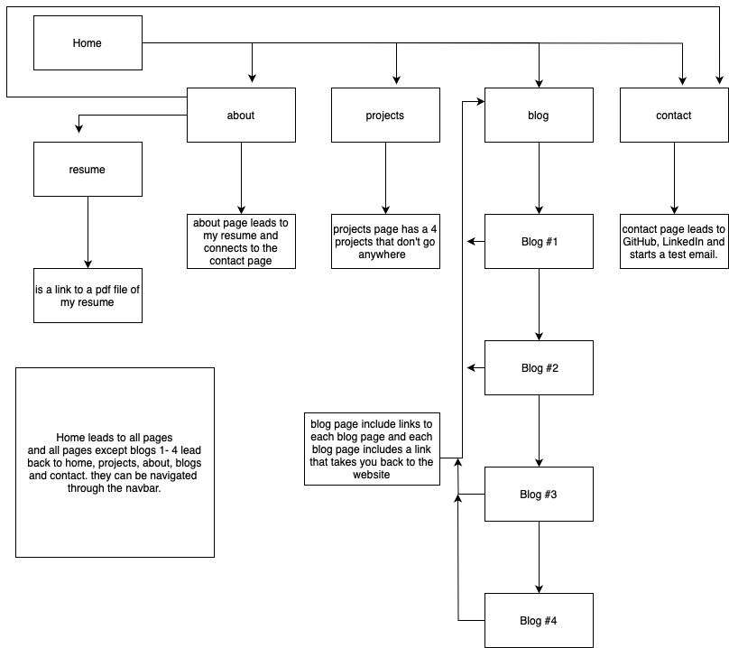

# Noah Morgan Portfolio

## Portfolio Discption

This purpose of this porfolio is to create a website to showcase your current and upcoming skills that have and will be learnt in the Coder Academy course. The goal for this website was to have something that is easy to navigate and read through but also look well thought out, stylish and have few animations through out

## Target Audience
The target audience for the project and website is any future employers. I hope to show my skills that I've developed and the skills that i learn and pick-up along the way. I also intend to keep using the website and updating it as mt portfolio increases

## Links

### Published Website
[Click Here](https://noahmorgan.netlify.app)

### Github
[Click Here](https://github.com/Noah-Morgan2/Portfolio)

### Presentaion Video

## Tech Stack
This project has used html and css to create and style the website. Github has been used to store everything and netlify has been used to publish the information stored in github. For the wireframes I used Figma and for the sitemap, Draw.io was used. For animations, Animate.css was used

## Sitemap

there are arrows connecting to each box, but due to the transparent background you'll be unable to see them with a dark background

# Wireframes

## Mobile View 
Home Page [Click Here](<docs/wireframes/home page mobile.pdf>)

About Page [Click Here](<docs/wireframes/about page mobile.pdf>)

Projects Page [Click Here](<docs/wireframes/projects page mobile.pdf>)

Blogs Page [Click Here](<docs/wireframes/blogs page mobile.pdf>)

Blogs 1-4 [Click Here](<docs/wireframes/blogs 1-4 mobile.pdf>)

Contact Page [Click Here](<docs/wireframes/contact page mobile.pdf>)

## Desktop View
Home Page [Click Here](<docs/wireframes/home page wireframe.pdf>)

About Page [Click Here](<docs/wireframes/about page wireframe.pdf>)

Projects Page [Click Here](<docs/wireframes/projects page wireframe.pdf>)

Blogs Page [Click Here](<docs/wireframes/blogs page mobile.pdf>)

Blogs 1-4 [Click Here](<docs/wireframes/blogs 1-4 wireframe.pdf>)

Contact Page [Click Here](<docs/wireframes/contact page wireframe.pdf>)

## Wireframes Discription
The purpose behind these wireframes is not to provide an in-depth display of the website but to show a general idead on how the websites layout is supposed to look on both a mobile or desktop view. After completing the website, some of the wireframes may not match up as they are only a plan/example of what the website should look like roughly.

# Design
The thought process behind the design of the website went through a lot of trial and error and the color sceme wasnt final until the end 

animations were used throughout the website as a way to show my skills and to also give an exciting feel to the site. I used Animate.css for the animations, which we had touched on in one of my previous lessons.
[Click Here](https://animate.style)

I did take into consideration the accessability of my website, while my website was on google chrome I used the lighthouse feature to run an accessablity check on it. I recieved a score of 86/100 for both mobile and desktop views

# Final Design
Home Page 
        - mobile 
        - desktop 

About Page 
        - mobile - 
                 - 
                 - 
        - desktop - 
                  - 

Projects Page
        - mobile - 
                 - 
                 - 
        - desktop - 
                 - 
                 - 

Blogs Page
        - mobile - 
                 - 
                 - 
        - desktop - 
                 - 
                 - 

Blog 1
        - mobile - 
        - desktop - 

Blog 2
        - mobile - 
        - desktop - 

Blog 3 
        - mobile - 
        - desktop - 

Blog 4
        - mobile - 
        - desktop - 

Contact Page 
        - mobile - 
        - desktop - 

# End Discription
This is the end of my portfolio assesment. I bumped into some challenges along the way and the design wasn't perfect but that due to my end with not having enough knowledge and experience

